# Password Genie
[](https://github.com/kaotickj/password-genie/releases) [](https://github.com/kaotickj/password-genie/blob/master/LICENSE) [](https://www.python.org/) [](https://github.com/kaotickj/password-genie) [](https://github.com/kaotickj/password-genie/commits/master)


Password Genie is a secure and user-friendly password management application built with Python and Tkinter. It allows users to generate strong passwords, hash and save passwords for various platforms, and retrieve them securely.


## Key Features:
- **Password Generation:** Create random and strong passwords based on user-defined criteria.
- **Password Hashing:** Hash passwords securely using SHA-256 for enhanced security.
- **Password Storage:** Safely store and retrieve passwords for different platforms in an encrypted format. All saved data undergoes robust encryption, ensuring it remains confidential and secure.
- **Master Password Protection:** Set and verify a master pass-key to ensure access control.

## Python Library/Module Dependencies:
- `tkinter`: This is a standard Python library for creating GUI applications. It is usually included with Python installations, so you don't need to install it separately. if for some reason you do not have tkinter as a standard library, you can install it with pip:
```
pip install tkinter
```
 
- `messagebox` from the tkinter library: messagebox is a submodule of the tkinter library.
- `secrets`: This module is used for generating cryptographically strong random numbers suitable for managing data such as passwords, account authentication, and security tokens. It is included in the Python standard library, so you don't need to install it separately. 
- `string`: This module contains a collection of string constants and utility functions. It is part of the Python standard library, so you don't need to install it separately.
- `base64`: This module provides functions for encoding binary data to ASCII characters and decoding ASCII characters back to binary data. It is part of the Python standard library, so you don't need to install it separately.
- `cryptography`: This library provides cryptographic recipes and primitives to Python developers. It can be installed using pip:
```
pip install cryptography 
```


## Usage:
### Set the Master Password:
#### Run the "set-master-password" utility to establish your master password:

1. Enter the master password that you want to use for encrypting and retrieving saved passwords:

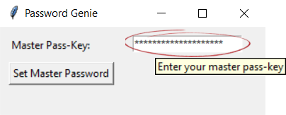

2. Click "Set Master Password" button:

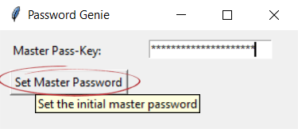

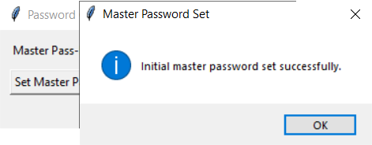

3. ***Do not forget your master password*** because you will not be able to recover it, and cannot retrieve saved passwords without it.

### Generate Strong Passwords: 
#### Run the "pwgenie" utility to generate, hash, save or retrieve passwords:

1. Verify Master Password: Enter your master password in the designated field and click "Verify Master Password" to unlock the app. The master password will be used to encrypt and retrieve saved passwords:

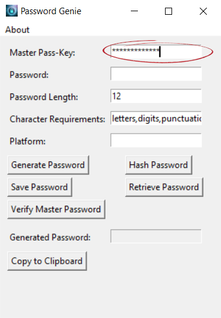

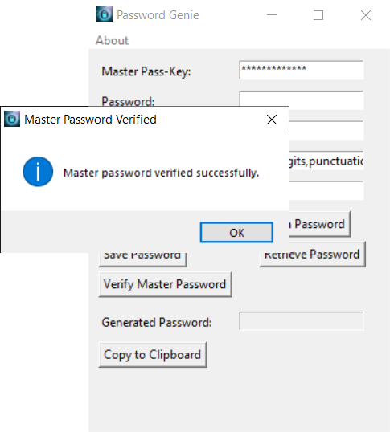

2. Set the password length by changing the relevant field. The default setting is 12 characters 

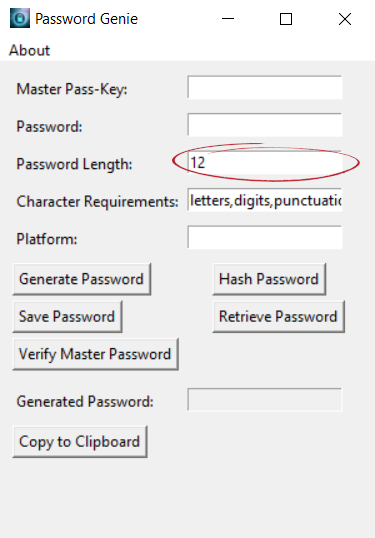


3. Set character requirements for generated passwords.  The default setting is to generate passwords that consist of upper and lowercase letters, numbers (digits), and special characters (punctuation). 

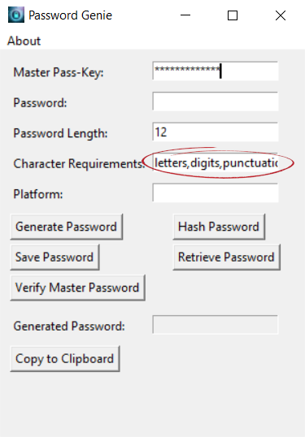

4. Click the "Generate Password" button to generate a password consisting of random characters using the parameters you set.

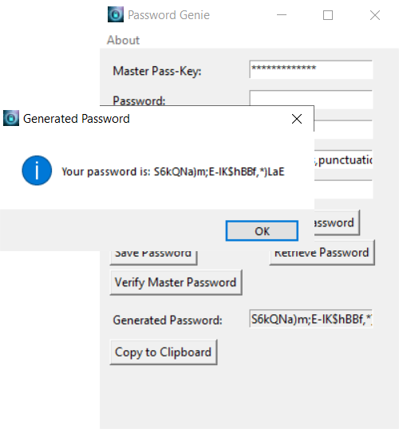

### Save Passwords:
After generating a strong password, you can assign it to a platform and save it as encrypted text for later retrieval.
 
1. Click the "Copy to Clipboard button to copy the generated password to the clipboard.

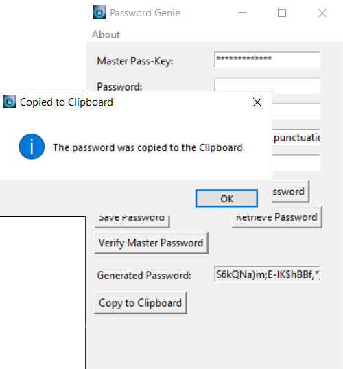

2. Paste the password into the field labelled "Password:" using your keyboard hotkey

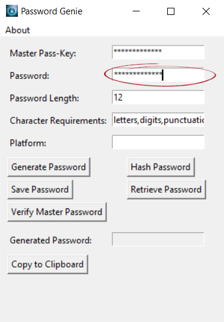

3. Enter the platform or site that the password is for in the field labelled "Platform:"

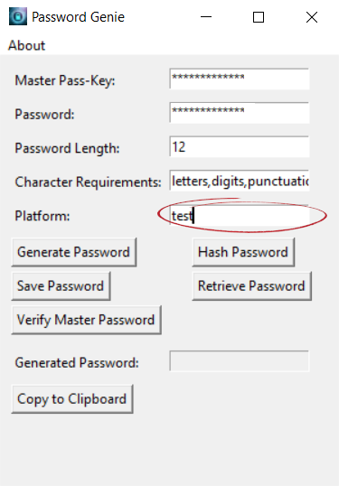

4. Click the "Save Password" button to encrypt and save the password and the associated platform.

### Retrieve Passwords:
1. Enter and verify your master password if you haven't already done so (see above).

2. Type the platform for which you want to retrieve the saved password into the Platform Field.

3. Click the "Retrieve Password" button to decrypt and show the platform's saved password.


#### About the Author:
Password Genie is developed and maintained by Kaotick Jay, a seasoned cybersecurity professional with 30 years of experience. 

#### License:
Password Genie is licensed under [GNU/GPL3](LICENSE). Feel free to contribute, modify, and distribute it in accordance with the terms of the license.

#### [Code of Conduct](CODE_OF_CONDUCT.md) | [Contributing Guidelines](CONTRIBUTING.md)
